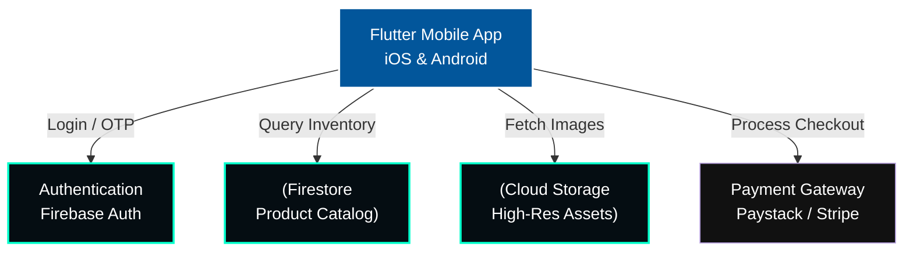

<div align="center">
  

  [](#)
  [](#)
  [](#)
</div>

## 🌍 Overview

[](SECURITY.md)
Welcome to the official repository for **Afro Fashion Mobile**. 
This is a premium mobile fashion hub built specifically for the African digital economy. It features high-fidelity asset showcasing, seamless cross-platform performance, and an intuitive user experience.

---

## 📐 System Architecture Demo

Our mobile commerce platform is built on a high-performance Flutter frontend tightly integrated with a serverless backend for real-time inventory and seamless checkout flows.



### 🛍️ Mobile Flow Demonstration
1. **Discovery:** The Flutter app fetches high-fidelity images from Cloud Storage and product metadata from Firestore in real-time.
2. **Engagement:** State management handles user favorites, cart sessions, and personalized sizing recommendations.
3. **Checkout:** Secure tokenization connects the cart to regional payment gateways (e.g., Paystack) for localized African currency processing.

---

## ⚡ Key Architectural Features
- **High-Performance UI:** Built with Flutter for smooth 60fps animations and native performance.
- **Real-Time Database:** Utilizes Firestore for instantaneous inventory updates.
- **Sovereign Infrastructure Ready:** Fully abstracted data layer, currently migrating to the Kirov Dynamics cloud ecosystem.
- **Responsive & Accessible:** Scales beautifully across different mobile screen sizes and accessibility settings.

## 🛠️ Local Development Setup

To run this project locally on your emulator or physical device:

```bash
git clone https://github.com/Raphasha27/afro_fashion_mobile.git
cd afro_fashion_mobile

# Install Flutter dependencies
flutter pub get

# Run the app
flutter run
```

## 🗺️ Roadmap
- [x] Clear dead links and optimize asset loading.
- [x] Upgrade documentation with System Architecture Diagrams.
- [ ] Migrate CI/CD to local GitHub Actions for automated IPA/APK builds.
- [ ] Implement AI-driven fashion recommendations.

<br/>
## Product Ladder

```
GitHub (this repo)
    ↓
Portfolio → https://raphasha27.github.io/raphasha-dev-portfolio
    ↓
Case Study → https://github.com/Raphasha27/afro_fashion_mobile/blob/main/CASE_STUDY.md
    ↓
Live Demo → https://github.com/Raphasha27/afro_fashion_mobile
    ↓
Contact → https://github.com/Raphasha27
```

Part of the [Kirov Dynamics](https://github.com/Raphasha27/kirov-dynamics) ecosystem.

**Built by Koketso Raphasha — Practical AI for Africa**

## License

MIT