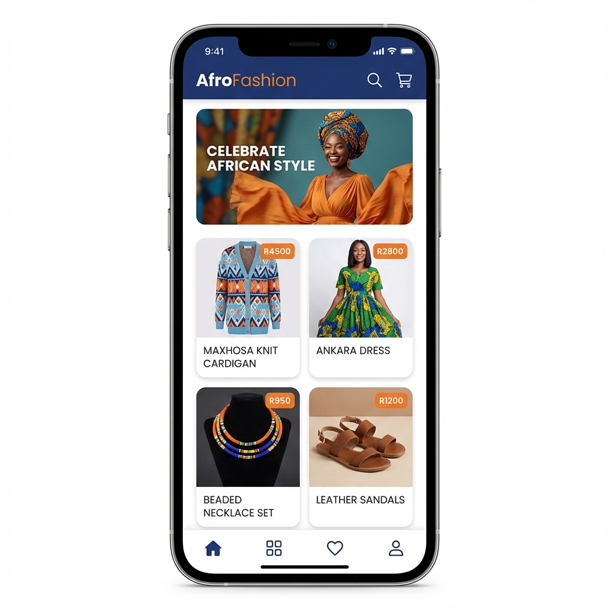

# 🏛️ KIROV DYNAMICS | AFROFASHION MOBILE (v2.0)

> **"Digital Excellence for the African Fashion Industry."**

## 🖼️ Visual Showcase

---
**AfroFashion** is a mobile application dedicated to showcasing and selling authentic African fashion from across the continent. Developed as a strategic commercial asset within the **Kirov Dynamics** infrastructure, it bridges local artisans with a global digital marketplace.

## ✨ Features

- **🛍️ Product Discovery**: Browse a curated list of African fashion items.
- **🏷️ Categorization**: Filter products by Men, Women, and Accessories.
- **🌍 Regional Highlights**: See where each piece originates from.
- **🛒 Shopping Cart**: Add items to your cart and manage your selections.
- **💳 Checkout (v2.0)**: Integrated with PayFast and Yoco for seamless payments.

## 🛠️ Tech Stack

- **Framework**: Flutter
- **Language**: Dart
- **State Management**: Provider / Riverpod ready
- **CI/CD**: Elite Developer v4.0.0 Standard

## 🚀 Getting Started

1. `git clone https://github.com/Raphasha27/afro_fashion.git`
2. `flutter pub get`
3. `flutter run`

---
*Developed by Raphasha27 - Kirov Dynamics 2026.*

